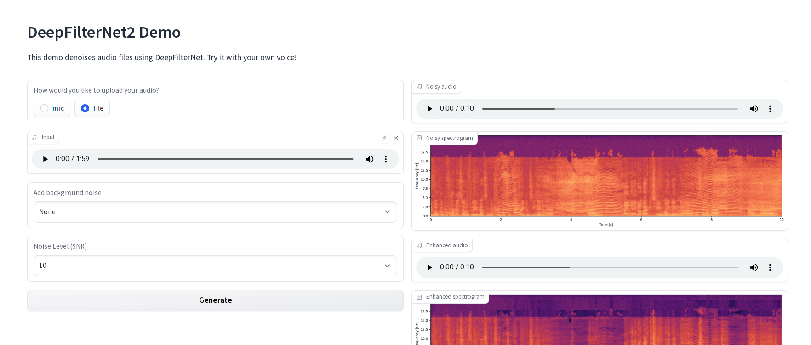

# Crying Baby Audio Scrub Test



An experimental project exploring AI-powered audio cleaning techniques to remove baby crying and fussing from voice recordings, enabling better speech-to-text transcription for busy parents.

## Quick Comparison

| | Before | After (DeepFilterNet) |
|---|---|---|
| **Audio** | [original-note.mp3](source/original-note.mp3) | [enhanced_output.mp3](deepnet-processed/enhanced_output.mp3) |
| **Transcript** | [View transcripts](stt-eval/stt_comparison_results.json) | [View transcripts](stt-eval/stt_comparison_results.json) |

## Overview

This repository tests various background noise removal and audio inpainting utilities to determine their effectiveness at removing crying baby sounds from audio recordings. The primary motivation is to enable reliable speech-to-text (STT) transcription for voice applications used by parents who may need to dictate messages while caring for young children.

## The Problem

Voice technology offers significant benefits for busy parents who need to dictate emails, notes, or messages rather than type them. However, when children start fussing during recording, background noise makes it nearly impossible for STT systems to produce accurate transcripts.

## Project Goal

This is a one-time experiment to assess:
- Whether AI-powered audio scrubbing can effectively remove baby crying from recordings
- The quality of the cleaned audio output
- Whether the cleaned audio enables successful STT transcription

The objective isn't to produce completely "kid-free" audio, but rather to clean it enough for STT systems to function properly.

## Proposed Pipeline

```
Noisy audio with baby → Clean audio with AI → Successful transcript
```

## Approach

Two categories of audio scrubbing tools were tested:

1. **"Press a button" AI audio scrubbing**: Cloud-based or GUI tools (tested outside this repo)
2. **Deep learning / local AI**: Local processing using deep learning models (DeepFilterNet)

## Results

After testing audio cleaning with DeepFilterNet and comparing STT transcription quality:

**Key Finding: Modern STT systems like Whisper already handle background baby crying remarkably well.**

The comparison between original audio (with baby crying) and DeepFilterNet-processed audio showed minimal differences in transcription quality:

- Both transcripts were highly accurate and readable
- Only subtle word choice differences (5-6 minor variations across 119 seconds)
- The original audio with baby crying was already successfully transcribed

**Conclusion**: For the use case of enabling STT transcription during voice dictation with background baby noise, audio cleaning preprocessing may be unnecessary. Whisper and similar modern STT models are already robust enough to handle this noise profile.

### Detailed Results

- **Comparison results**: [stt-eval/stt_comparison_results.json](stt-eval/stt_comparison_results.json)
- **Original audio**: [source/original-note.mp3](source/original-note.mp3)
- **DeepFilterNet processed audio**: [deepnet-processed/enhanced_output.mp3](deepnet-processed/enhanced_output.mp3)
- **STT evaluation script**: [stt-eval/whisper_comparison.py](stt-eval/whisper_comparison.py)

## Audio Files

- **`source/original-note.mp3`**: Unedited recording of a shopping list with baby crying in the background
- **`source/cancel.mp3`**: Isolated segment of crying/fussing
- **`deepnet-processed/enhanced_output.mp3`**: Audio processed with DeepFilterNet for noise removal

## Technical Setup

This project used:
- DeepFilterNet for audio noise removal
- OpenAI Whisper API for STT transcription comparison
- Python with uv for dependency management

## License

This is an experimental research project.

## Author

Daniel Rosehill
